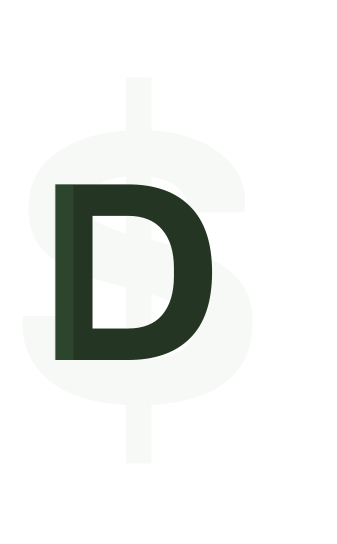

# DOMang

- [Usage](#usage)
- [Contribute](#contribute)

### About
Using the familiar jQuery dollar sign ($), easily manipulate, create and animate elements using DOMang, a lightweight, easy and fast javascript library.

#### Functions

- Quick selector ($).
- Basic CSS operations (addclass, removeclass).
- Simplified event listeners (on, click, ...).
- Animations (ex.: quick intersection observers)
- And much more...

### usage
You can use DOMang by the CDN link:

#### CDN link
```html
<script src="https://rawcdn.githack.com/KauanRakoski/DOMang/5842d8107474c0ca24c20da3a378832f8aa876f8/script.js"></script>
```

#### NPM installation
Or you can install it running the command - we are working on this. Use the CDN link instead. :/ :

```
npm install domang
```

And then import it:
```javascript
import $ from 'domang';
```

## Getting started
After that, you are able to start coding. Code example:
```javascript
  $('document').ready(function(){
            $('.someItem').resize(3, 1);
            
            $('.someItem').on('mouseover', function(){
                console.log('mouseover');
            });

            $('.someItem').on('click', function(){
                $('.someItem').css('background-color', 'white');
            })

            $('.someOtherItem').rawReveal() <-- creates a simple intersection observer
        })
```


### Version
V - 1.1.2 

**Last updates** 

Minor changes and improvements. 

Bug correction.

# contribute
If you are a developer and want to contribute, read the following lines:

## What is domang purpose
- Make development easier.
- Simplify boring tasks.
- Make hard stuff easier.

### Task list
If you want to contribute, you can do anything you want if it is useful. Urgent tasks are:

- [ ] State managing methods - toogle methods for example.
- [ ] Create static and scroll animate methods.
- [ ] Create a "design system" - a logical repo organization.

## How to Contribute
First, you need to fork the repository. Then, you can clone it to yout local machine:

```bash
$ git clone https://github.com/your-username/DOMang
```
After that, you can start working and, when everything is done, you can make a pull request.