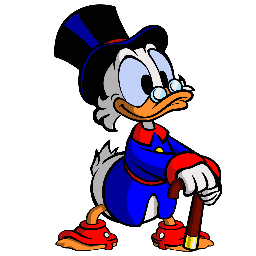

<h1 align="center">Scrooge</h1>
<p align="center">
   &nbsp; 
   &nbsp; 
   &nbsp; 
  
</p>

<p align="center"></p>

- [Usage](#usage)
- [Contribute](#contribute)

### About
Scrooge is a very simple, jquery-like, library for javascript. It aims to make HTML manipulation easier

#### Functions

- Quick selector ($).
- Basic CSS operations (addclass, removeclass).
- Simplified event listeners (on, click, ...).
- Animations (ex.: quick intersection observers)
- And much more...

### usage
You can use scrooge by the CDN link:

#### CDN link
```html
<script src="https://cdn.jsdelivr.net/gh/KauanRakoski/Scrooge/all.js"></script>
```

#### NPM package
```bash
npm install scroooge
```
## Getting started
After that, you are able to start coding. Code example:
```javascript
  $('document').ready(function(){
            $('.someItem').resize(3, 1);
            
            $('.someItem').on('mouseover', function(){
                console.log('mouseover');
            });

            $('.someItem').on('click', function(){
                $('.someItem').css('background-color', 'white');
            })

            $('.someOtherItem').reveal() <-- creates a simple intersection observer
        })
```


### Version
V - 1.1.6 

**Last updates** 

Minor changes and improvements. 

Bug correction.

# contribute
Contribution is very appreciated. Feel free to fork and create a pull request, or open an issue.

------
Made with ❤️ and javascript.
